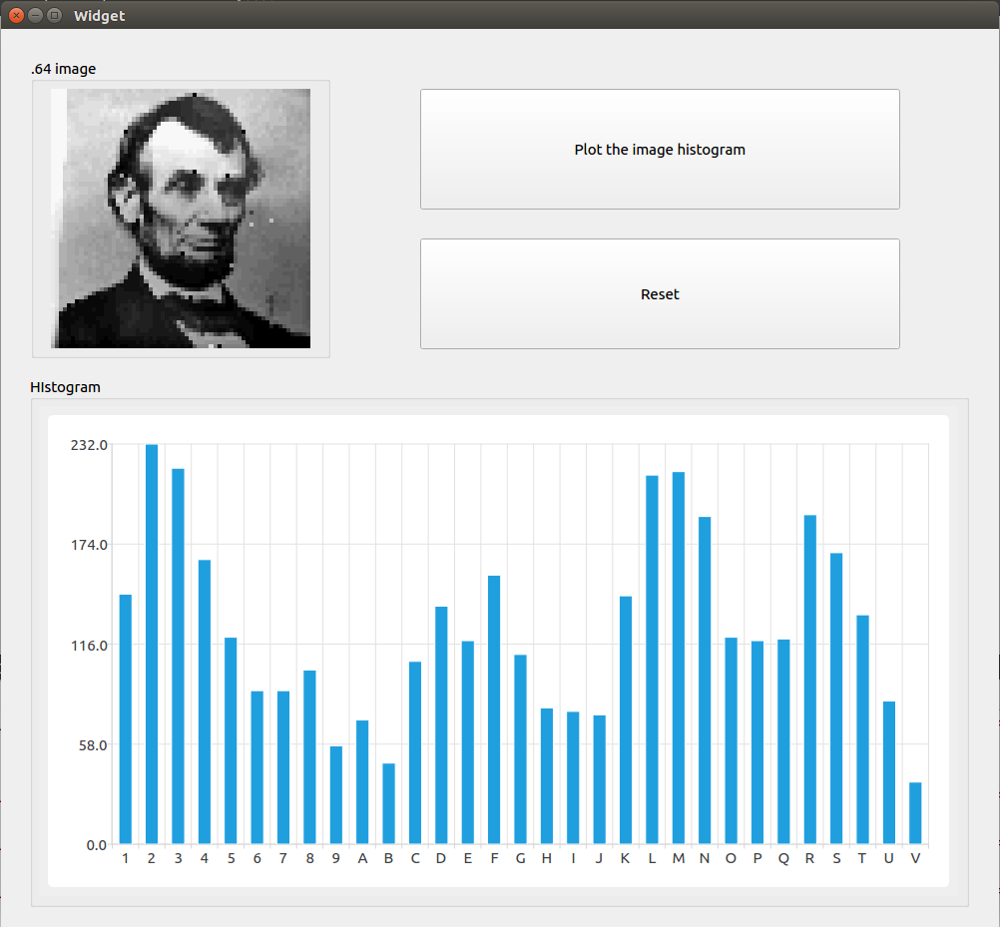
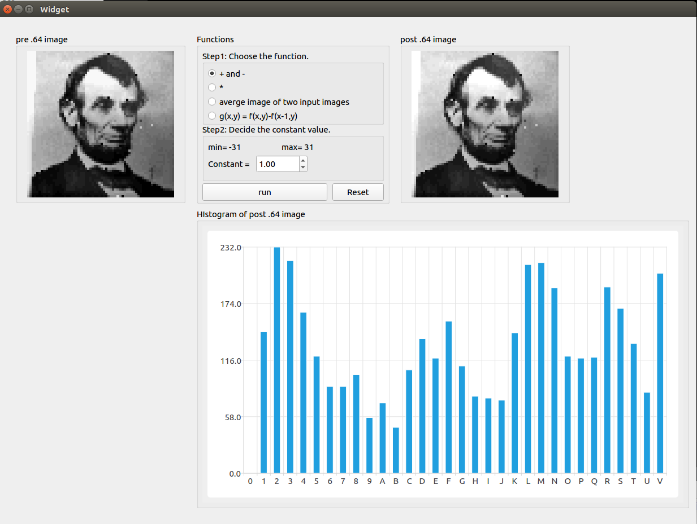
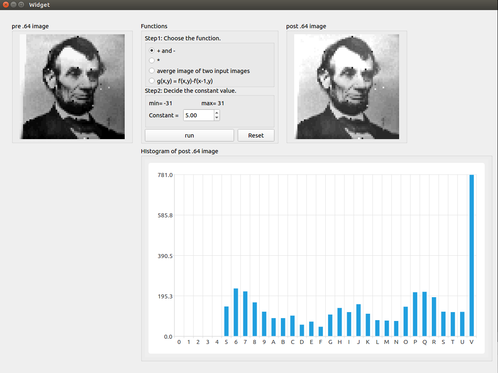
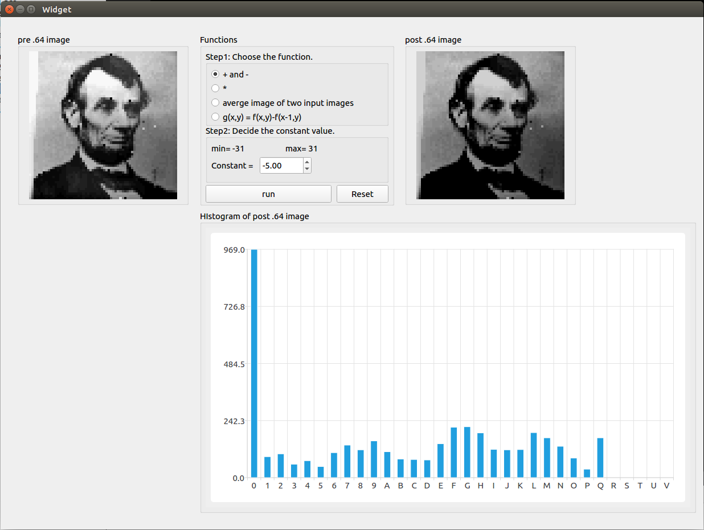
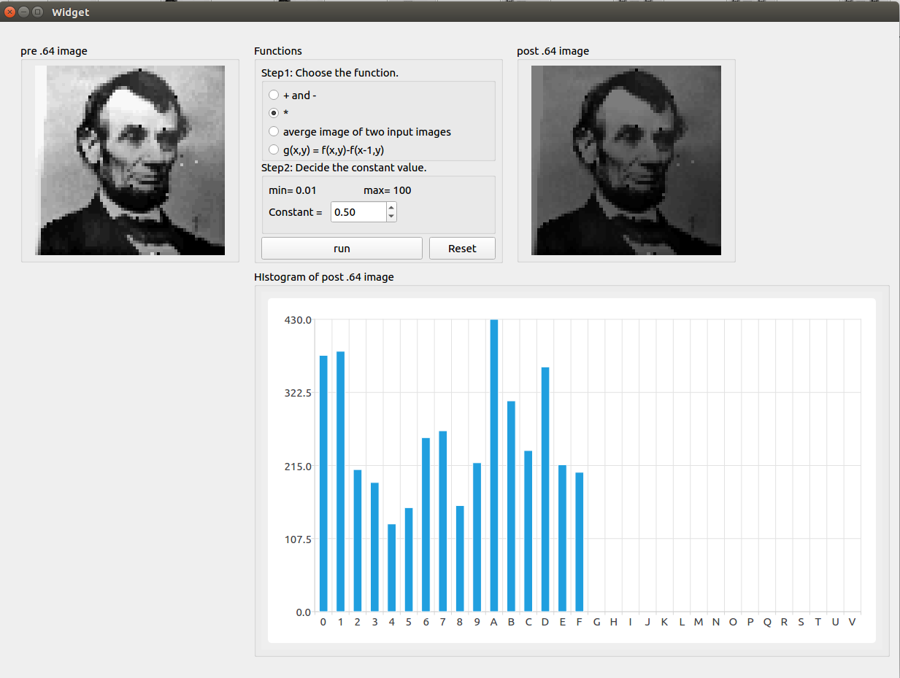
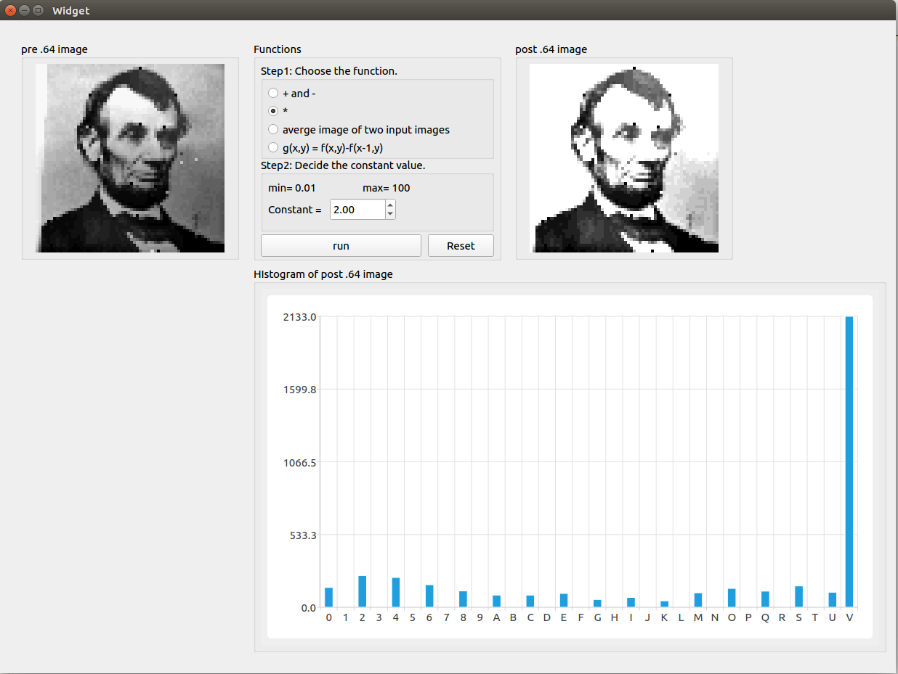
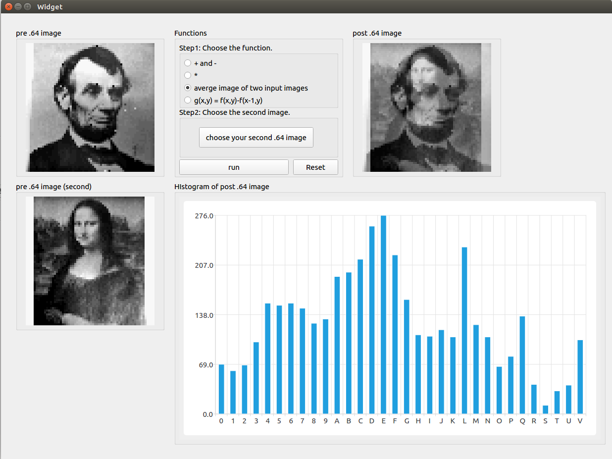
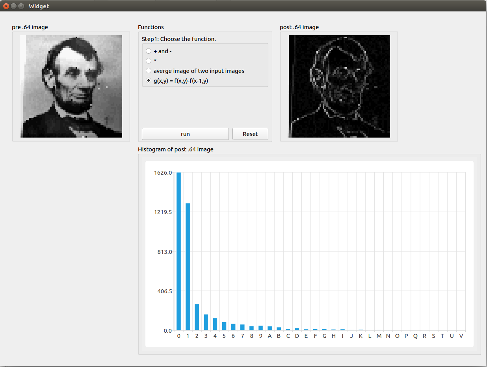

# README

## Problem

*more detail, please see [C1HW01-2018.pdf](./C1HW01-2018.pdf).*

* Implement .64 image file reader.
  * .64 image: 64x64 image with 32 gray levels
* Plot the histogram of .64 image.
* Implement arithmetic Operations of an Image Array.

## Program

### ''0', 1', ..., '9', 'A', 'B', ... 'F' -> 0, 1, ..., 9, 10, 11, ..., 15

```cpp
int ascii_hex_to_int(char c){
    if (c>='0' && c<='9') return c-'0';
    if (c>='A' && c<='F') return c-'A'+10;
    return 0;
}
```

### Arithmetic Operations of an Image Array
```cpp
void function(QImage &qimg) {
    int width, height;
    
    width = image->width();
    height = image->height();
    for (int i = 0; i < width; i++) {
        for (int j = 0; j < height; j++) {
            QRgb rgb = qimg.pixel(i, j);
            /*
                do something
            */
            qimg.setPixel(i, j, rgb);
        }
    }
}
```

## Usage

### hw1_1

1. Make and execute   

   ```sh
   $ cd ./hw1_1
   $ qmake -makefile
   $ make
   $ ./hw1_1
   ```

2. Functions

   * `Choose your .64 image`
   * `Plot the image histogram`
   * `Reset`

    

### hw1_2

1. Make and execute   

   ```sh
   $ cd ./hw1_2
   $ qmake -makefile
   $ make
   $ ./hw1_2
   ```

2. Functions

   * Choose the function
     * \+, -
     * \*
     * Average of two images
     * g(x, y) \= f(x, y) - f(x-1, y-1)

      

## Results

### \+, -





### \*





### Average of two images


### g(x, y) \= f(x, y) - f(x-1, y-1)
