# README  

## Problem  
*more detail, please see [C1HW01-2018.pdf](./C1HW01-2018.pdf).*

* Implement .64 image file reader.
  * .64 image: 64x64 image with 32 gray levels
* Plot the histogram of .64 image.
* Implement arithmetic Operations of an Image Array.

## How to Use  
* Step 0: 開啟 hw1_1_boxed.exe  
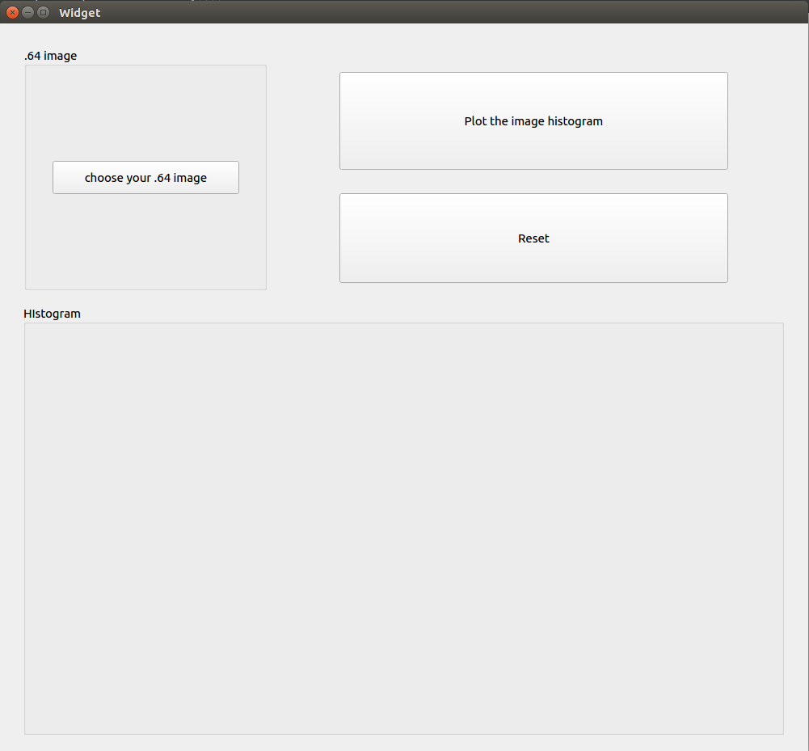  

* Step 1: 按下 [ choose your .64 image ] 按鈕，選取 .64檔。  
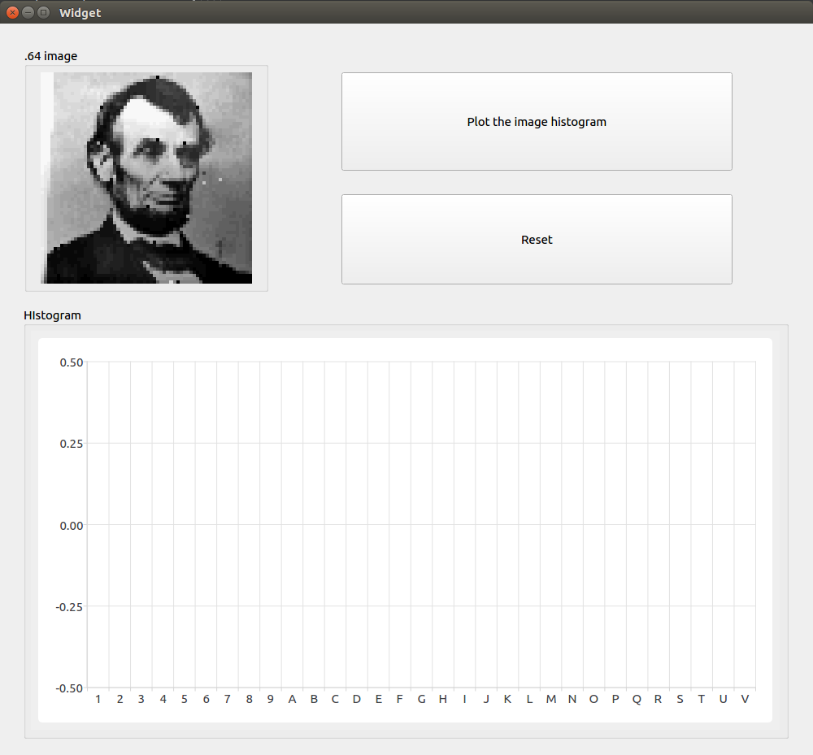  

* Step 2: 按下 [ Plot the image histogram ] 按鈕，繪製 histogram。  
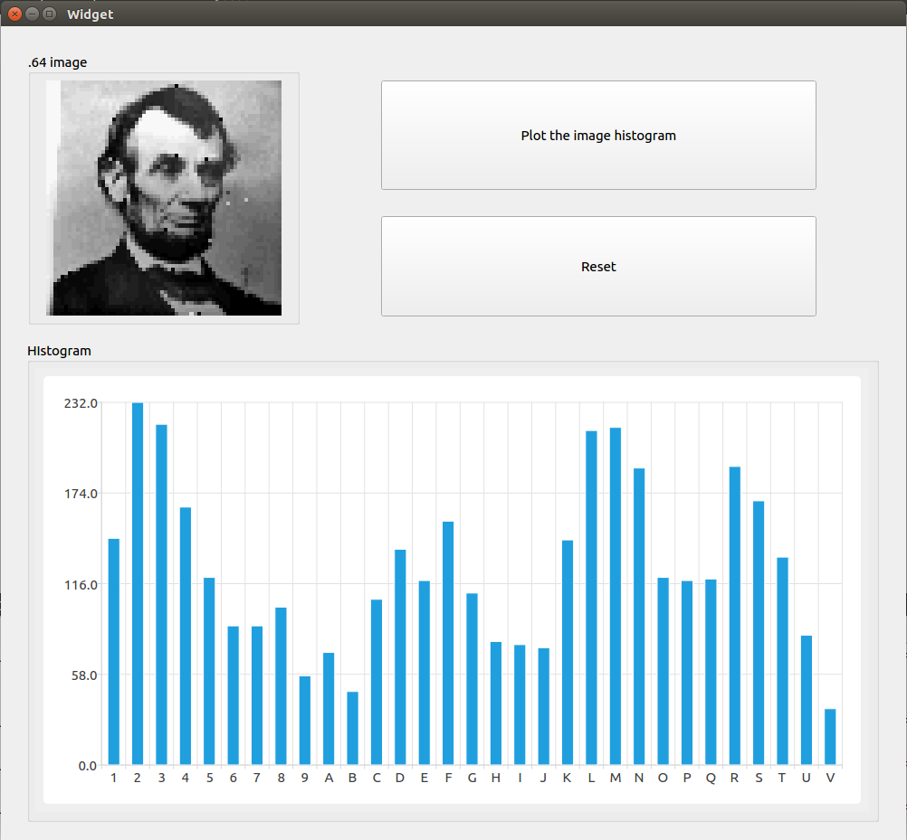  

* Step 3: 按下 [ Reset ]，可重新選擇 .64檔。  
## 編程架構  
以下以 head檔 做簡介。  
`widget.h` -> 完整檔案請參考程式原始碼。  

首先引入需要的 library。  
```c++
#include <QWidget>
// QImage 儲存影像的物件
#include <QImage>
// QLabel 用來顯示圖像
#include <QLabel>
// QFileDialog 用來開啟檔案
#include <QFileDialog>
// 顯示直方圖
#include <QtCharts>
// 開啟檔案
#include <fstream>
#include <iostream>
#include <vector>
#include <sstream>
```
建立常用的命名空間。  
```c++
using namespace std;
using namespace QtCharts;
```
建立會使用到的 SLOT。  
* choose_source: 選擇圖片。  
* create_histogram: 生成 histogram。  
* reset: 回復到初始狀態。  

以上三個功能各自對應到 Button。
```c++
private slots:
    void choose_source(void);
    void create_histogram(void);
    void reset(void);
```

建立一個 srcImg，來儲存開啟的圖片。  
```C++
private:
    QImage srcImg = QImage(64,64,QImage::Format_RGB32);
```

建立一個 histogram[32] 來儲存直方圖的數值。  
```c++
    int histogram[32] = {0};
```

建立四個會用到的函數。  
* void convert_file_to_QImage(): 把讀取到的檔案轉換成 QImage 的格式。
* void choose_image(): 選擇圖片。
* void load_image(): 將圖片印在 label 上。
* vector<vector<char>> read_file_to_2D_vector(): 回傳一個二維 vector，協助 convert_file_to_QImage()。

```c++
    void convert_file_to_QImage(const QString &fileName, QImage* image);
    void choose_image(const QString &title, QImage* image, QLabel* label);
    void load_image(const QString &fileName, QImage* image, QLabel* label);
    int convert_16_to_10(char c);
    vector<vector<char>> read_file_to_2D_vector(const QString &fileName);
```

# HW1_2 README  
## How to Use  
* Step 0: 開啟 hw1_2_boxed.exe  
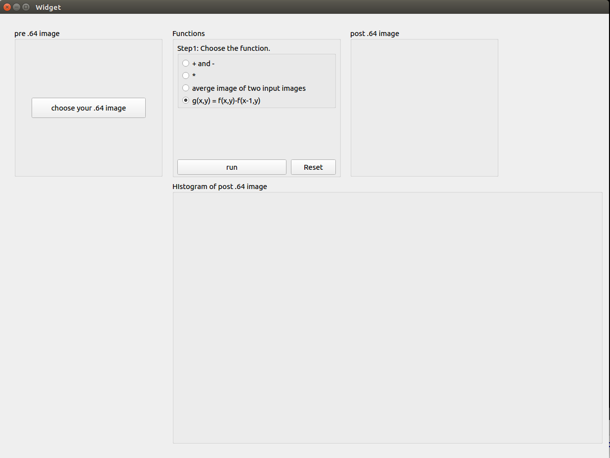  

* Step 1: 按下 [ choose your .64 image ] 按鈕，選取 .64檔。
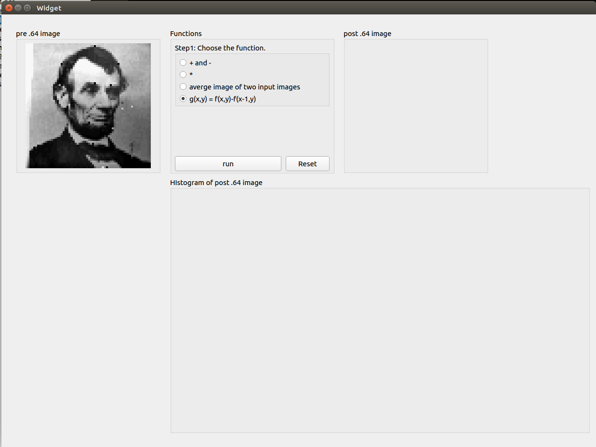  

* Step 2: 選取需要的功能後，按下 [ run ]。  
  

* Step 3: 按下 [ Reset ]，可重新選擇 .64檔。 

## 編程架構  
以下以 head檔 做簡介。  
`widget.h` -> 完整檔案請參考程式原始碼。  

首先引入需要的 library。  
```c++
#include <QWidget>
// QImage 儲存影像的物件
#include <QImage>
// QLabel 用來顯示圖像
#include <QLabel>
// QFileDialog 用來開啟檔案
#include <QFileDialog>
// 顯示直方圖
#include <QtCharts>
#include <fstream>
#include <iostream>
#include <vector>
#include <sstream>
```
建立常用的命名空間。  
```c++
using namespace std;
using namespace QtCharts;
```
建立會使用到的 SLOT。  
* choose_source: 選擇圖片。  
* create_histogram: 生成 histogram。  
* reset: 回復到初始狀態。  
* turn_state_0: 傳換成功能零，加減。
* turn_state_1: 傳換成功能一，乘。
* turn_state_2: 傳換成功能二，兩圖平均。
* turn_state_3: 傳換成功能三，位移後相減。
* compute: 對應到 [ run ] 按鈕。

以上三個功能各自對應到 Button。
```c++
private slots:
    void choose_source(void);
    void choose_source1(void);
    void create_histogram(void);
    void reset(void);
    void turn_state_0(void);
    void turn_state_1(void);
    void turn_state_2(void);
    void turn_state_3(void);
    void compute(void);
```

建立三個 srcImg，來儲存開啟的圖片。  
* srcImg1: 儲存計算前的圖片。  
* srcImg2: 儲存計算後的圖片。  
* srcImg3: 儲存第三小題的第二張圖片。  
```C++
private:
    QImage srcImg1 = QImage(64,64,QImage::Format_RGB32);
    QImage srcImg2 = QImage(64,64,QImage::Format_RGB32);
    QImage srcImg3 = QImage(64,64,QImage::Format_RGB32);
```

建立一個 histogram[32] 來儲存直方圖的數值。  
```c++
    int histogram[32] = {0};
```

建立一個 funcStat 來儲存選取的功能，預設功能三。  
```c++
    int funcStat = 3;
```
建立一個 constant 來儲存功能中會使用的參數。  
```c++
    float constant = 1;
```
建立四個功能各自的 function。  
```c++
    void add_sub_functions(QImage* image, float constant);
    void mul_sub_functions(QImage* image, float constant);
    void move_the_image(QImage* image);
    void average_of_the_images(QImage* image);
```
建立四個會用到的函數。  
* void convert_file_to_QImage(): 把讀取到的檔案轉換成 QImage 的格式。
* void choose_image(): 選擇圖片。
* void load_image(): 將圖片印在 label 上。
* vector<vector<char>> read_file_to_2D_vector(): 回傳一個二維 vector，協助 convert_file_to_QImage()。

```c++
    void convert_file_to_QImage(const QString &fileName, QImage* image);
    void choose_image(const QString &title, QImage* image, QLabel* label);
    void load_image(const QString &fileName, QImage* image, QLabel* label);
    int convert_16_to_10(char c);
    vector<vector<char>> read_file_to_2D_vector(const QString &fileName);
```
## 討論  
### 功能一：加減  
#### constant=1  
便是原圖。  
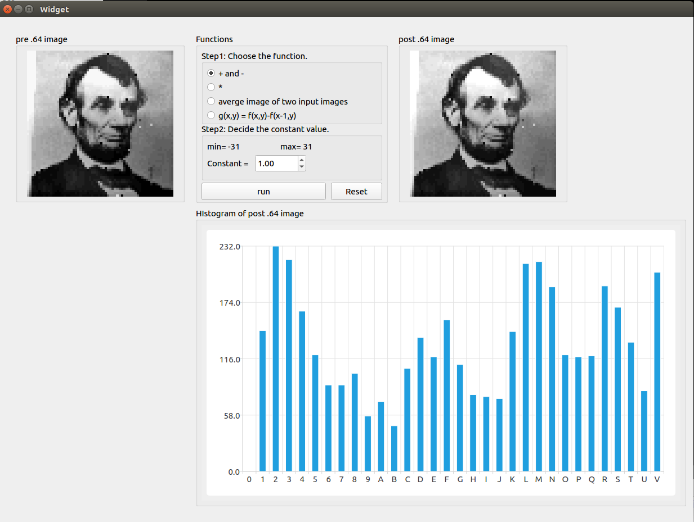  
#### constant=+5  
從圖中可以發現，當pixel+5，直方圖會右移，多出 V 的就疊加在 V 上，而且圖案變亮。  
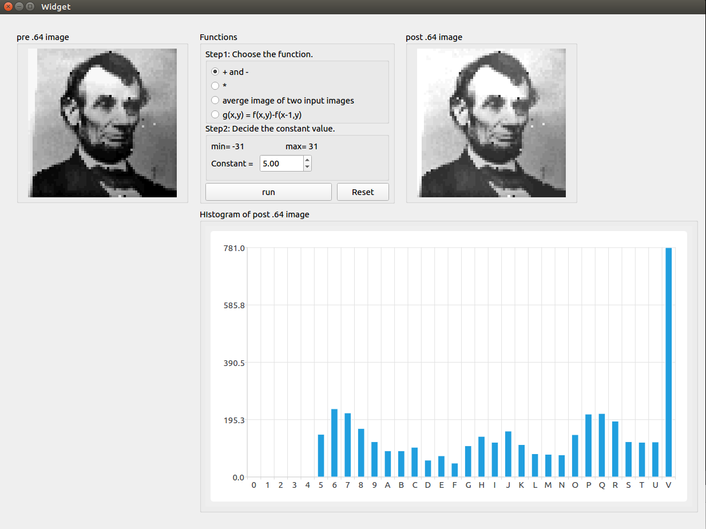  
#### constant=-5  
從圖中可以發現，當pixel-5，直方圖會左移，少於 0 的就疊加在 0 上，而且圖案變暗。  
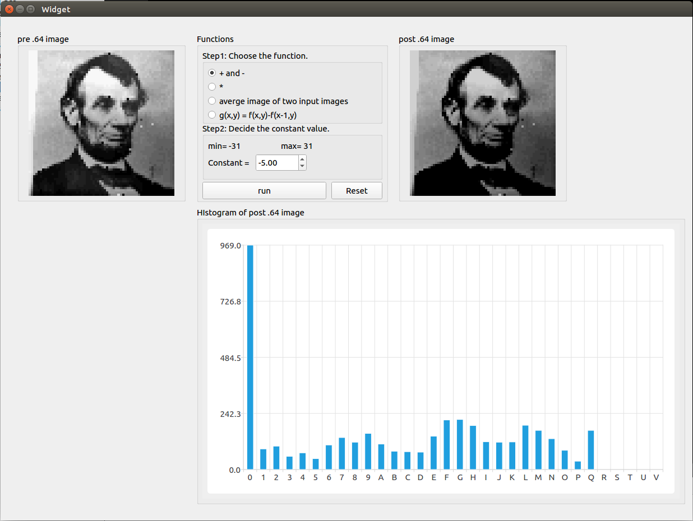  

### 功能二：乘  
#### constant=1  
便是原圖。  
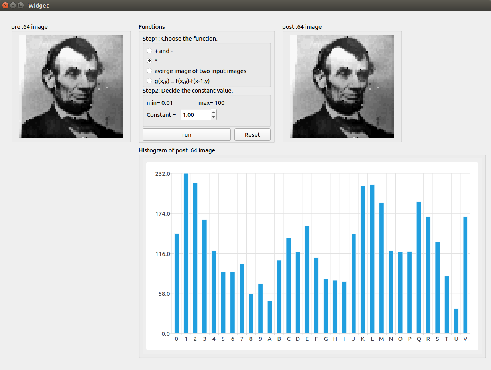  
#### constant=2  
從圖中可以發現，當pixel*2，直方圖會變成間隔，多出 V 的就疊加在 V 上，而且圖案變亮。  
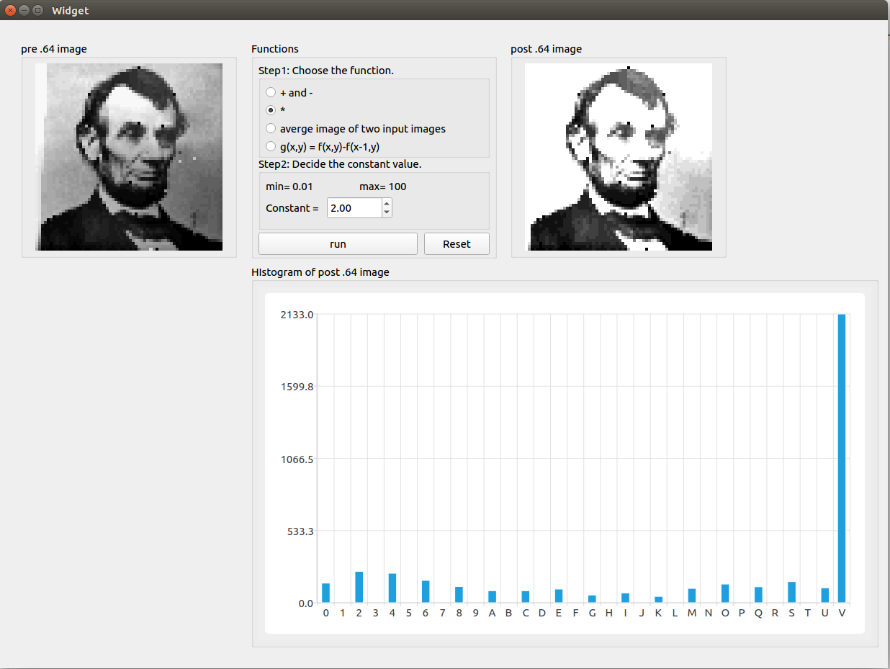  
#### constant=0.5  
從圖中可以發現，當pixel*0.5，直方圖會向左一個pixel疊加，少於 0 的就疊加在 0 上，而且圖案變暗。  
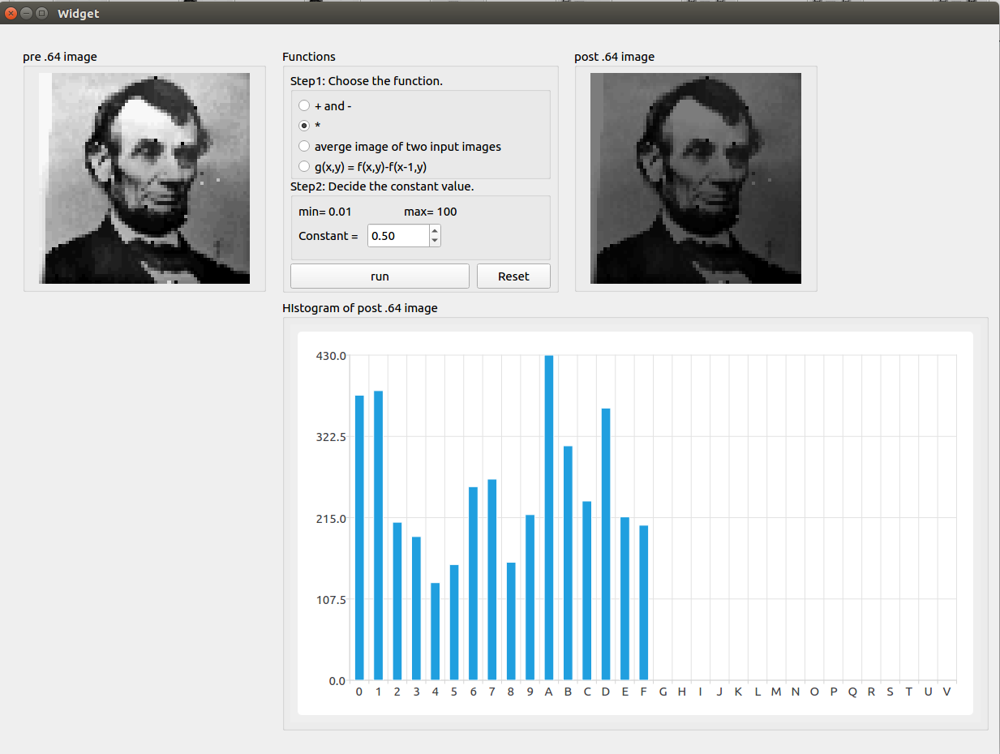  

### 功能三：平均合併  
#### LINCOLN + LISA  
即使是合併了之後，仍然可以從圖片中看到兩張圖，且直方圖便是合起來的平均。  
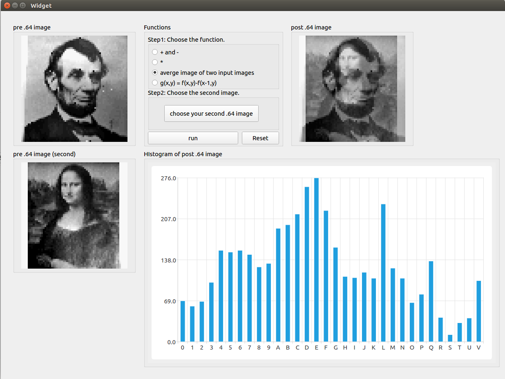  

### 功能四：位移後相減  
#### LINCOLN + LISA  
位移後相減可以發現邊界變得更明顯了，而且直方圖會往左邊靠，幾乎是二值化後的結果。  
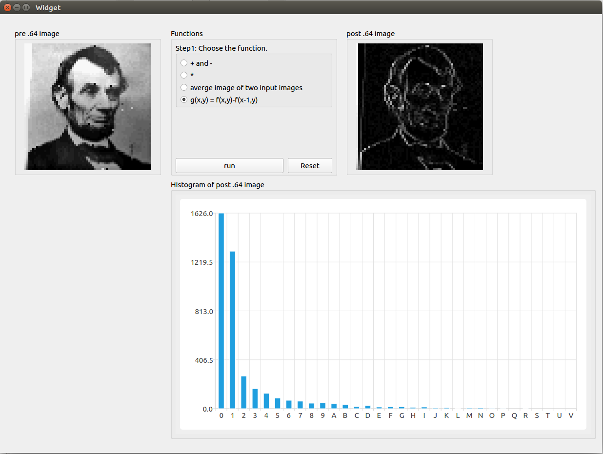  