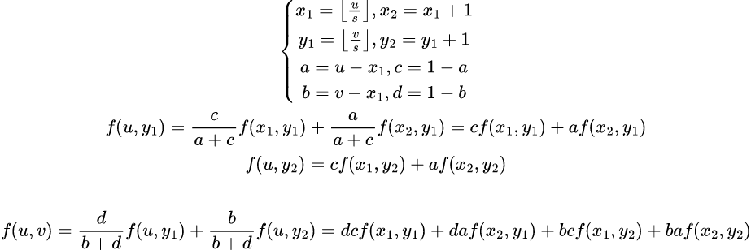
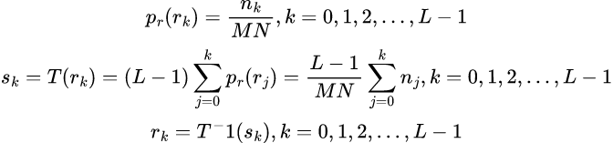

# README  

## Problem  
*more detail, please see [C1HW02-2018.pdf](./C1HW02-2018.pdf).*

* Convert a color image into a grayscale image, and display its histogram.
* Implement
  * a manual **threshold** function.
  * a function to **adjust the spatial resolution** and grayscale levels of an image.
  * a function to adjust the **brightness** and **constrast** of an image.
  * a **histogram equalization** function for automatic constrast adjustment.

## Program
### Enlarge  

<!-- 
\left\{\begin{matrix}
x_1 = \left \lfloor \frac{u}{s} \right \rfloor, x_2=x_1+1
\\ 
y_1 = \left \lfloor \frac{v}{s} \right \rfloor, y_2=y_1+1
\\
a = u-x_1, c=1-a
\\
b = v-x_1, d=1-b
\end{matrix}\right.
\\
f(u, y_1)=\frac{c}{a+c}f(x_1, y_1)+\frac{a}{a+c}f(x_2, y_1)=cf(x_1, y_1)+af(x_2, y_1)\\
f(u, y_2)=cf(x_1, y_2)+af(x_2, y_2)\\
\\
f(u, v)=\frac{d}{b+d}f(u, y_1)+\frac{b}{b+d}f(u, y_2)=dcf(x_1, y_1)+daf(x_2, y_1)+bcf(x_1, y_2)+baf(x_2, y_2)
 -->
```cpp
...
QImage Widget::enlarge(QImage &img, int scaled) {
    int width, height;
    QImage simg(width*scaled, height*scaled);

    for (int u=0; u<simg.width(); ++u) {
        for (int v=0; v<simg.height(); ++v) {
            int x, y, pixel;
            float a, b, c, d;

            x = int(u/scaled); y = int(v/sacled);
            a = float(u)/float(scaled)-x; c = 1-a;
            b = float(v)/float(scaled)-y; d = 1-b;

            if ((x+1)==width) || ((y+1)==height) {
                pixel = 0;
            }
            else {
                pixel = c*d*img.pixel(  x,   y) +
                        a*d*img.pixel(x+1,   y) +
                        c*b*img.pixel(  x, y+1) +
                        a*b*img.pixel(x+1, y+1);
            }
            simg.setPixel(u, v, pixel);
        }
    }
}
...
```

### Histogram equalization  

<!-- 
$$
p_r(r_k)=\frac{n_k}{MN}, k=0,1,2,...,L-1\\
s_k=T(r_k)=(L-1)\sum_{j=0}^{k}p_r(r_j)=\frac{L-1}{MN}\sum_{j=0}^{k}n_j, k=0,1,2,...,L-1\\
r_k=T^-1(s_k), k=0,1,2,...,L-1\\
$$
 -->
```cpp
...
QImage Widget::histogram_equalization(QImage &img) {
    int width, height, pixel_sum;
    int gray_array[256] = {0};
    int accumulate_gray_array[256] = {0};
    int pixel_table[256] = {0};
    QImage he_img(img.size());

    width = img.width(); height = img.height();
    for(int i=0; i<width; ++i) {
        for(int j=0; j<height; ++j) {
            int pixel;
            pixel = qimg.pixel().qGray();
            ++gray_array[pixel];
        }
    }

    pixel_sum = width*height;
    accumulate_gray_array[0] = gray_table[0];
    pixel_table[0] = round(255.0*float(accumulate_gray_array[0])/pixel_sum);
    for(int i=1; i<256; ++i) {
        accumulate_gray_array[i]+=accumulate_gray_array[i-1]
        pixel_table[i] = round(255.0*float(accumulate_gray_array[i])/pixel_sum);
    }

    for(int i=0; i<width; ++i) {
        for(int j=0; j<height; ++j) {
            int pixel;
            pixel = qimg.pixel().qGray();
            he_img.setPixel(i, j, pixel_table[pixel]);
        }
    }
    return he_img;
}
...   
```

## Usage  
```sh
$ qmake -makefile
$ make
$ ./hw2
```

## Results  
### Brightness  
-40, -20 and +20  


### Contrast
-2, 2, 4  


### Histogram equalization  


