# README  

## Problem  
*more detail, please see [C1HW02-2018.pdf](./C1HW02-2018.pdf).*

* Convert a color image into a grayscale image, and display its histogram.
* Implement
  * a manual **threshold** function.
  * a function to **adjust the spatial resolution** and grayscale levels of an image.
  * a function to adjust the **brightness** and **constrast** of an image.
  * a **histogram equalization** function for automatic constrast adjustment.

## Program
### Adjust the spatial resolution  
* Enlarge

$$
\left\{\begin{matrix}
x_1 = \left \lfloor \frac{u}{s} \right \rfloor, x_2=x_1+1
\\ 
y_1 = \left \lfloor \frac{v}{s} \right \rfloor, y_2=y_1+1
\end{matrix}\right.\\
\\
\left\{\begin{matrix}
a = u-x_1, c=1-a
\\
b = v-x_1, d=1-b
\\
\end{matrix}\right.\\
f(u, y_1)=\frac{c}{a+c}f(x_1, y_1)+\frac{a}{a+c}f(x_2, y_1)=cf(x_1, y_1)+af(x_2, y_1)\\
f(u, y_2)=cf(x_1, y_2)+af(x_2, y_2)\\
\\
f(u, v)=\frac{d}{b+d}f(u, y_1)+\frac{b}{b+d}f(u, y_2)=dcf(x_1, y_1)+daf(x_2, y_1)+bcf(x_1, y_2)+baf(x_2, y_2)
$$


### Histogram equalization  

## Usage  
```sh
$ qmake -makefile
$ make
$ ./hw2
```

## Results  
### Brightness  
-40, -20 and +20
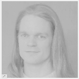
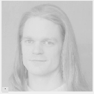
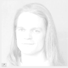

### Contrast
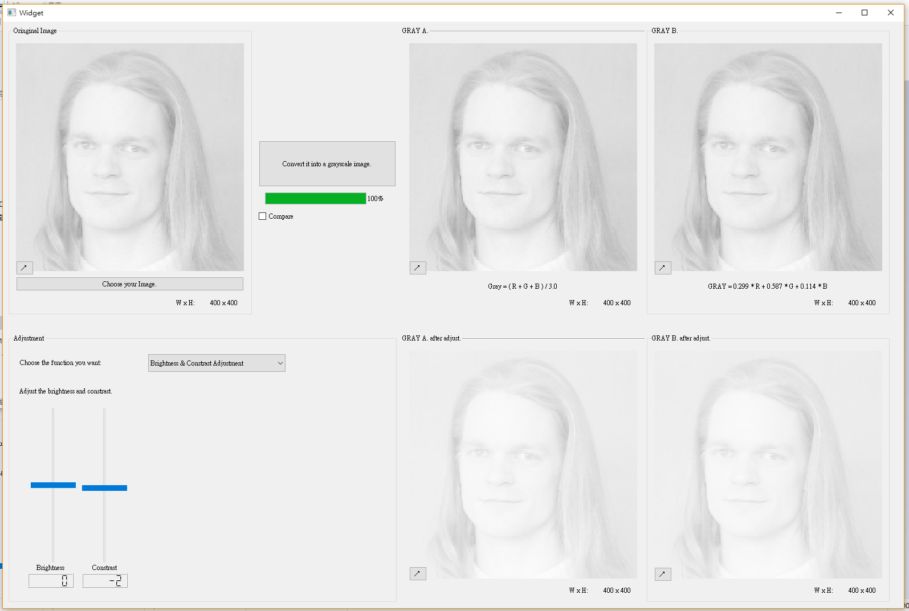
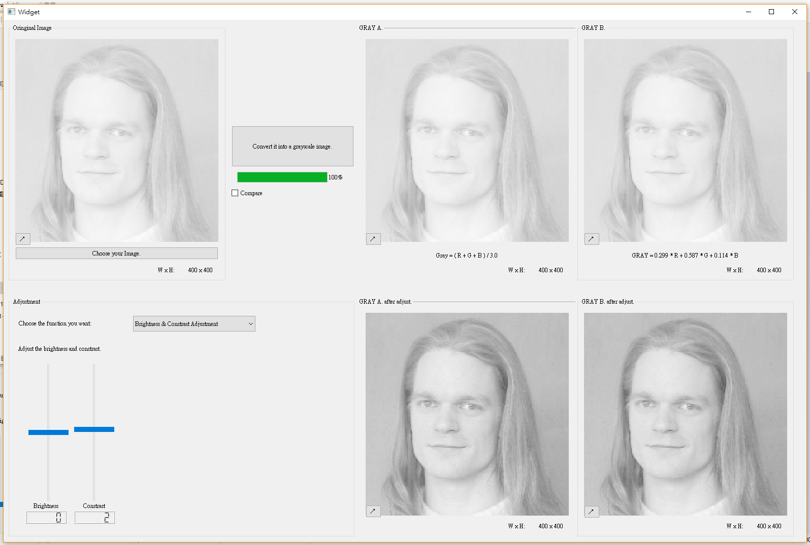
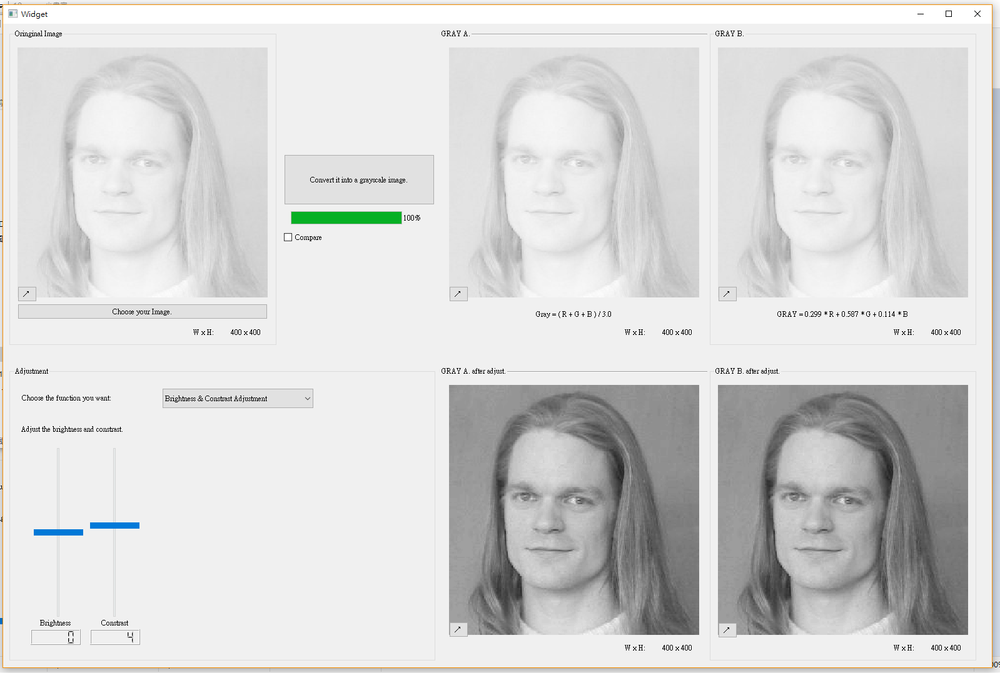
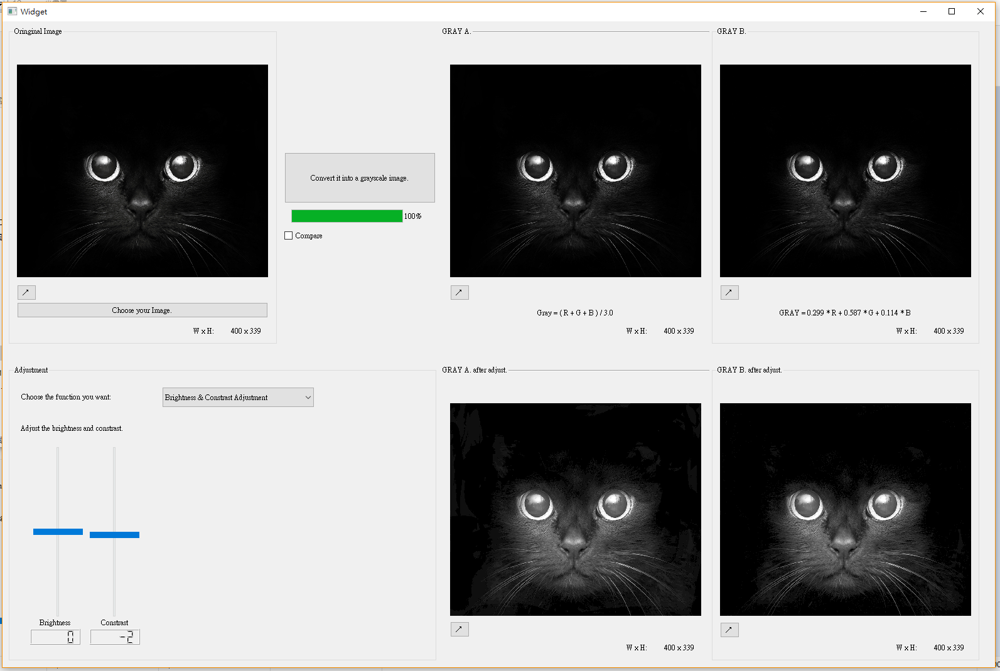
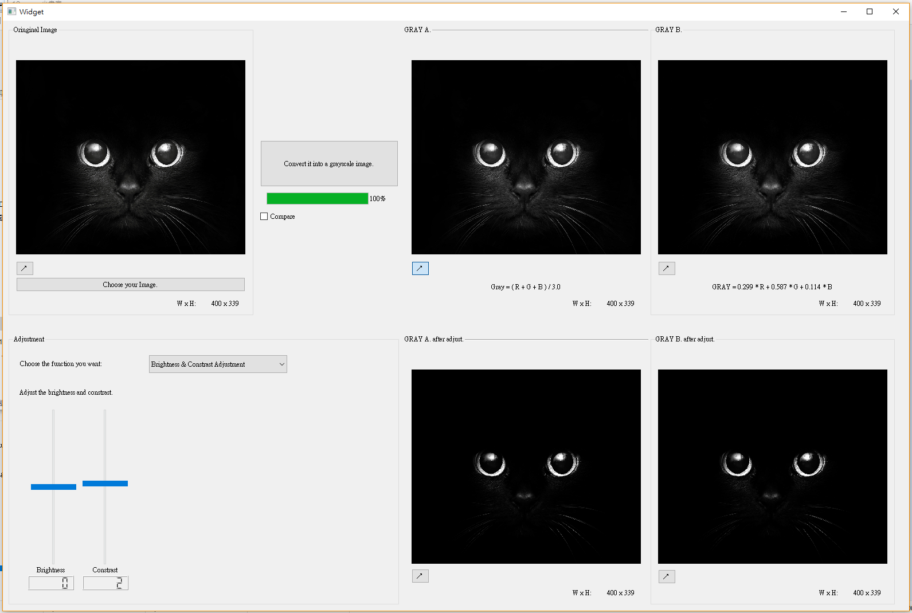
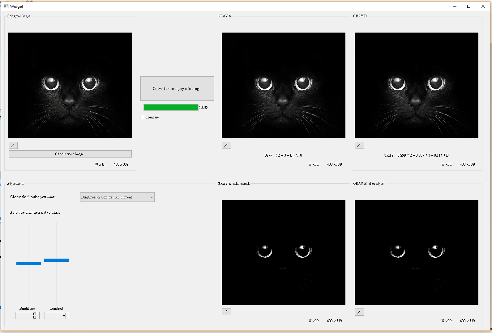

### Histogram equalization  
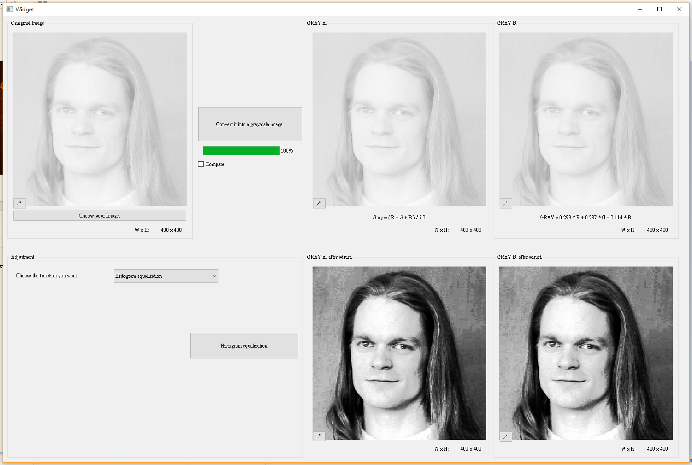
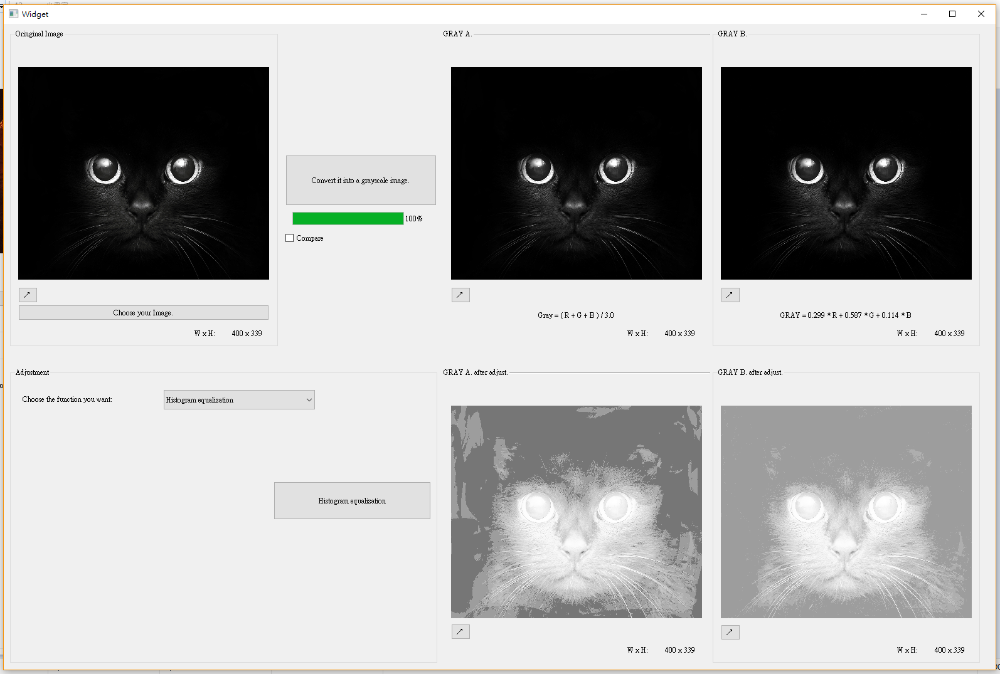
