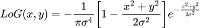
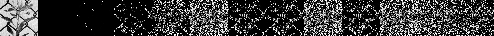
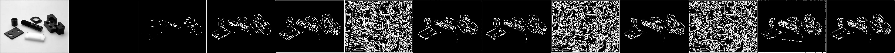
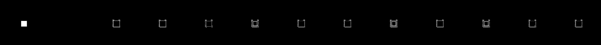
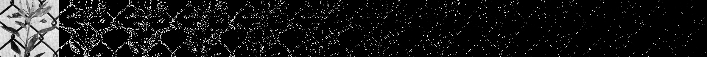

# README  

## Problem  
*more detail, please see [C1HW03-2018.pdf](./C1HW03-2018.pdf).*

* Implement spatial filtering operations using various types of masks.
  * It is flexible for
    * mask size
    * coefficients in the mask
* Implement a Marr-Hildreth edge detection, and compare the results with those processed with the Sobel operator.
* Implement an order-statistic filter function for users to select
  (Also be flexible in choosing different filter sizes)
  * median filter
  * max filter
  * min filter

## Program  
<!-- $$
LoG(x,y)=\frac{x^2+y^2–\sigma^2}{2\pi \sigma^6}e^{-\frac{x^2+y^2}{2\sigma^2}}
$$ -->
### Marr-Hildreth edge detection  
1. LoG filter  
     

    ```cpp
    int **log_filter(int filter_size, float sigma=1.4) {
        assert(filter_size%2==1);

        int **filter = new int*[filter_size];
        float d;

        d = 4.0*(filter_size+1)*(PI*pow(sigma, 4));
        for(int i=0; i<filter_size; ++i) {
            filter[i] = new int[filter_size];
            for(int j=0; j<filter_size; ++j) {
                float x, y;
                float t, log;

                x = float(i-int(filter_size/2));
                y = float(j-int(filter_size/2));

                t = -1.0*(pow(x, 2)+pow(y, 2))/(2*pow(sigma, 2));
                log = -1.0/(PI*pow(sigma, 4))*(1.0+t)*exp(t);
                
                filter[i][j] = round(d*log);
            }
        }
        return filter;
    }

    int **convolution(QImage &img, int **filter, int filter_size) {
        int width, height;
        int **c_r;

        width = img.width();
        height = img.height();

        c_r = new int*[height];
        for(int i=0; i<height; ++i) {
            c_r[i] = new int[width];
            for(int j=0; j<width; ++j) {
                int pixel = 0;

                for(int k=filter_size-1; k>=0; --k) {
                    int i_k;

                    i_k = int(i-(k-int(filter_size/2)));
                    for(int l=filter_size-1; l>=0; --l) {
                        int j_l;

                        j_l = int(j-(l-int(filter_size/2)));
                        if((i_k<0)||(i_k>=width)||(j_l<0)||(j_l>=height)) pixel+=0;
                        else {
                            pixel+=(filter[k][l]*qGray(img.pixel(j_l, i_k)));
                        }
                    }
                }
                c_r[i][j] = pixel;
            }
        }
        return c_r;
    }
    ```

2. Zero Crossings
    ```cpp
    int **zero_crossing(int **c_r, int width, int height, int threshold=0) {
        int **c_g;
        
        c_g = new int*[height];
        for(int i=0; i<height; ++i) {
            c_g[i] = new int[width];
            for(int j=0; j<width; ++j) {
                int count = 0;
                for(int k=-1; k<1; ++k) {
                    for(int l=-1; l<1; ++l) {
                        if((k==0)&&(l==0)) continue;

                        int t_px, n_px;
                        int i_n_px, j_n_px;

                        i_n_px = i+k; j_n_px = j+l;
                        t_px = c_r[i][j]; n_px = c_r[i_n_px][j_n_px];
                        
                        if((i_n_px<0)||i_n_px>=height) continue;
                        if((j_n_px<0)||j_n_px>=width) continue;
                        if((t_px*n_px<0)&&(abs(t_px-n_px)>threshold)) {
                            c_g[i][j] = 1;
                            goto end;
                        }
                    }
                }
                end:;
            }
        }
        return c_g;
    }
    ```

```cpp
QImage edge_detection(QImage &img, int &filter_size, float sigma=1.4, int threshold=0) {
    int **filter, **c_r, **c_g;
    int width, height;
    QImage img_out;

    width = img.width();
    height = img.height();
    filter = log_filter(filter_size, sigma);
    c_r = convolution(img, filter, filter_size);
    c_g = zero_crossing(c_r, width, height, threshold);
    img_out = int_array_to_QImage(c_g, width, height, 255);
    return img_out;
}
```

## Usage  
```sh
$ cd hw3_cli
$ qmake -makefile
$ make
$ ./hw3_cli <path-to-image> <filter_size> <sigma> <threshold>
```

## Results
### Marr-Hildreth edge detection  
* filter size= 3, 5, 7, ..., 25; sigma= 1.2; threshold= 0
  
  
  
* threshold= 0, 400, 800, 1200, 1600, 2000, 2400, 2800, 3200, 3600
  * filter size= 13; sigma= 1.2; threshold= 0, 400, 800, ..., 4000
    
  * filter size= 7; sigma= 1.2; threshold= 0, 400, 800, ..., 4000
    
  * filter size= 5; sigma= 1.2; threshold= 0, 400, 800, ..., 4000
    
  