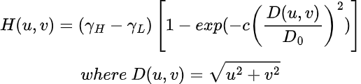
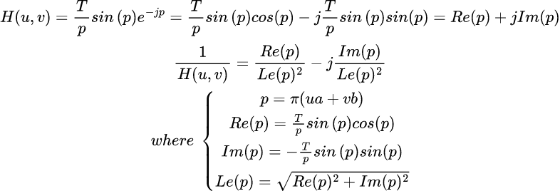
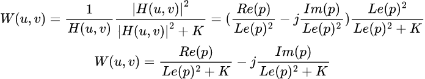
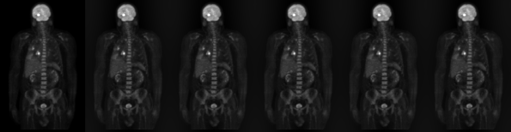
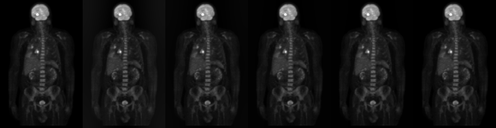

# README  

## Problem  
*more detail, please see [C1HW04-2018.pdf](./C1HW04-2018.pdf).*

* Implement Fourier transform(FFT) of an image.
* Implement the highpass and lowpass filter using
  * Ideal filter
  * Butterworth filter
  * Gaussian filter
* Implement a homomorphic filter.
* Apply a 2-D frequency domain inverse filter and Wiener filter to remove motion blur of image.

## Program  
### Homomorphic filter  
<!-- $$
H(u, v)=(\gamma_H-\gamma_L)\left[ 1-exp(-c\left( \frac{D(u, v)}{D_0} \right)^2) \right]\\
where\ D(u, v)=\sqrt{u^2+v^2}
$$ -->

```cpp
Mat homomorphic_filter(int cols, int rows, float gh, float gl, float c, float d0) {
    Mat h;
    Mat plane[2] = { Mat::zeros(rows, cols, CV_32F), Mat::zeros(rows, cols, CV_32F) };
    for(int i=0; i<rows; ++i) {
        for(int j=0; j<cols; ++j) {
            float u, v, d_uv, r;

            u = float(j-cols/2);
            v = float(i-rows/2);
            d_uv = sqrt(pow(u, 2)+pow(v, 2));
            r = (gh-gl)*(1.0-exp(-c*(pow(d_uv, 2)/pow(d0, 2))))+gl;
            plane[0].at<float>(i, j) = r;
        }
    }
    merge(plane, 2, h);
    h = to_shift(h);
    return h;
}
```

### Create motion blur and its inverse filter  
<!-- $$
H(u, v)=\frac{T}{p}sin\left( p \right)e^{-jp}=\frac{T}{p}sin\left( p \right)cos(p)-j\frac{T}{p}sin\left( p \right)sin(p)=Re(p)+jIm(p)\\
\frac{1}{H(u, v)}=\frac{Re(p)}{Le(p)^2}-j\frac{Im(p)}{Le(p)^2}\\
where\ \left\{ \begin{array}{cl}
p=\pi(ua+vb) \\
Re(p)=\frac{T}{p}sin\left( p \right)cos(p) \\
Im(p)=-\frac{T}{p}sin\left( p \right)sin(p) \\
Le(p)= \sqrt{Re(p)^2+Im(p)^2}
\end{array} \right.
$$ -->


```cpp
Mat motion_blurred_filter(int cols, int rows, float t, float a, float b, bool inverse=false, float threshold=0.0) {
    Mat h;
    Mat plane[] = { Mat::zeros(rows, cols, CV_32F), Mat::zeros(rows, cols, CV_32F) };

    for(int i=0; i<rows; ++i) {
        for(int j=0; j<cols; ++j) {
            float u, v, p;
            float re, im;
            u = float(j-cols/2);
            v = float(i-rows/2);
            p = PI*(a*u+b*v);
            if (p==0) { re = 0; im = 0; }
            else {
                re = t/p*sin(p)*cos(p);
                im = -t/p*sin(p)*sin(p);

                if (inverse) {
                    float l;
                    l = pow(re, 2)+pow(im, 2);
                    if (l<threshold) { re = 0; im = 0; }
                    else { re = re/(l+1); im = -im/(l+0.1); }
                }
            }
            plane[0].at<float>(i, j) = re;
            plane[1].at<float>(i, j) = im;
        }
    }
    merge(plane, 2, h);
    h = to_shift(h);
    retur
```
### Wiener filter  
<!-- $$
W(u, v)=\frac{1}{H(u, v)}\frac{\left| H(u, v) \right|^2}{\left| H(u, v) \right|^2+K}=(\frac{Re(p)}{Le(p)^2}-j\frac{Im(p)}{Le(p)^2})\frac{Le(p)^2}{Le(p)^2+K}\\
W(u,v)=\frac{Re(p)}{Le(p)^2+K}-j\frac{Im(p)}{Le(p)^2+K}
$$ -->

```cpp
Mat wiener_filter(int cols, int rows, float t, float a, float b, float k) {
    Mat h;
    Mat plane[] = { Mat::zeros(rows, cols, CV_32F), Mat::zeros(rows, cols, CV_32F) };

    for(int i=0; i<rows; ++i) {
        for(int j=0; j<cols; ++j) {
            float u, v, p;
            float re, im, l;
            u = float(j-cols/2);
            v = float(i-rows/2);
            p = PI*(a*u+b*v);
            if (p==0) { re = 0; im = 0; }
            else {
                re = t/p*sin(p)*cos(p);
                im = -t/p*sin(p)*sin(p);
                l = pow(re, 2)+pow(im, 2);
                re = re/(l+k); 
                im = -im/(l+k);
            }
            plane[0].at<float>(i, j) = re;
            plane[1].at<float>(i, j) = im;
        }
    }
    merge(plane, 2, h);
    h = to_shift(h);
    return h;
}
```

## Usage  
```sh
$ cd hw4_cli
$ qmake -makefile
$ make
# Homomorphic filter
$ ./hw4_cli hf <image> <g_h> <g_l> <c> <d0>
# Motion blur filter
$ ./hw4_cli mb <image> <t> <a> <b>
# Inverse motion blur filter
$ ./hw4_cli ib <image> <t> <a> <b> <threshold>
# Wiener filter
$ ./hw4_cli wf <image> <t> <a> <b> <k>```
```

## Results  
### Homomorphic filter  

* $\gamma_H$=1, 2, ..., 5; $\gamma_L$=0; c=1; d=1  
    

* $\gamma_H$=3; $\gamma_L$=0, c=1, 2, ...,5; d=1  
    

* $\gamma_H$=3; $\gamma_L$=0, c=2; d=1, 1.5, 2, 2.5, 3  
    

### Motion blur and Inverse filter v.s. Wiener filter
origin, motion blurred, inverse filter and wiener filter
* a=b=0.05  
    
