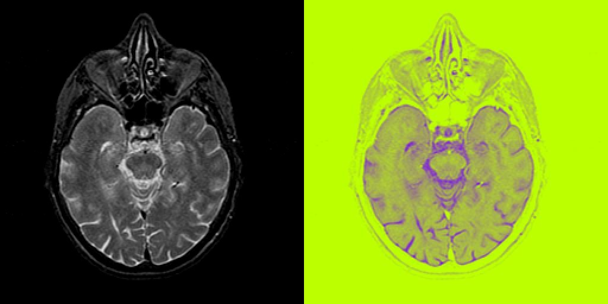

# README  

## Problem  
*more detail, please see [C1HW05-2018.pdf](./C1HW05-2018.pdf).*

* Implement the **color model conversion**
  * RGB
  * CMY
  * HSI
  * XYZ
  * L*a*b*
  * YUV
* Implement a program to display **a grayscale image in pseudo-color**
* Implement a **image segmentation** by color clustering, using the k-means algorithm.

## Program  
### Image segmentation  
```cpp
QImage image_segmentation(QImage &img, int k) {
    Mat mat, best_labels, centers, mat_out;
    int rows, cols, size;
    Vec4f color[k];
    int count[k] = { 0 };
    QImage img_out(img.width(), img.height(), QImage::Format_RGB32);
    TermCriteria tc(TermCriteria::EPS+TermCriteria::MAX_ITER, 10, 1.0);

    mat = qimage_to_mat(img);
    rows = mat.rows;
    cols = mat.cols;
    size = rows*cols;

    mat.convertTo(mat, CV_32FC4);
    mat = mat.reshape(0, size);
    kmeans(mat, k, best_labels, tc, 10, KMEANS_PP_CENTERS, centers);
    
    for (int i=0; i<size; ++i) {
        int label;
        label = best_labels.at<int>(i);
        color[label] += mat.at<Vec4f>(i, 0); 
        ++count[label];
    }
    for (int i=0; i<k; ++i) color[i] /= count[i];

    mat_out = Mat(size, 1, CV_32FC4);
    for (int i=0; i<size; ++i) {
        int label;
        label = best_labels.at<int>(i);
        mat_out.at<Vec4f>(i) = color[label];
    }
    mat_out = mat_out.reshape(0, rows);

    mat_out.convertTo(mat_out, CV_8UC4);
    img_out = mat_to_qimage(mat_out);    
    return img_out;
}
```


## Usage  
```sh
$ cd hw5_cli
$ qmake -makefile
$ make
# pseudo-color  
$ ./hw5_cli psdcolor <image> <lcolor> <rcolor>
# Image segmentation
$ ./hw5_cli is <image> <k>
```

## Results
### pseudo-color  


### Image segmentation
origin, 3, 5, 7, 9


