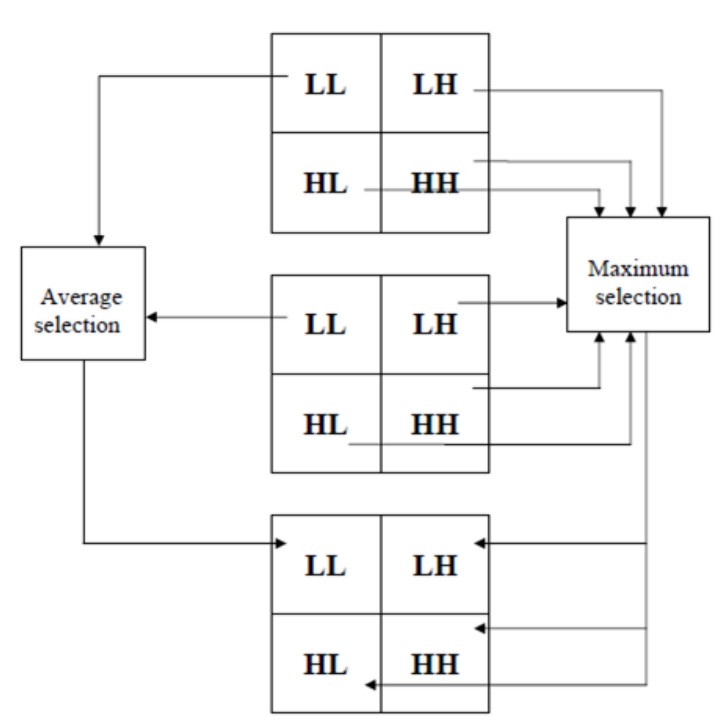

# README  

## Problem  
*more detail, please see [C1HW06-2018.pdf](./C1HW06-2018.pdf).*

* Implement **geometric transformation** of an image.
* Implement an **image fusion** program applying the DWT method.
* Apply a **Hough transform method**.

## Program  
### Image Fusion  
#### $DWT$  
$$
\left\{\begin{array}{cl}
h_\phi[-n]=\{\frac{1}{\sqrt2},\frac{1}{\sqrt2}\}\\ 
h_\psi[-n]=\{\frac{-1}{\sqrt2},\frac{1}{\sqrt2}\}
\end{array}\right.
$$


```cpp
Mat dwt(Mat &mat, float *phi, float *psi) {
    assert(mat.type()==CV_32FC1);
    int rows = mat.rows; int cols = mat.cols;
    Mat l_mat = Mat::zeros(rows, cols/2, CV_32FC1);
    Mat h_mat = Mat::zeros(rows, cols/2, CV_32FC1);
    Mat dwt_mat = Mat::zeros(rows, cols, CV_32FC1);
    Mat ll_mat(dwt_mat, Rect(     0,      0, cols/2, rows/2));
    Mat hl_mat(dwt_mat, Rect(cols/2,      0, cols/2, rows/2));
    Mat lh_mat(dwt_mat, Rect(     0, rows/2, cols/2, rows/2));
    Mat hh_mat(dwt_mat, Rect(cols/2, rows/2, cols/2, rows/2));

    for(int i=0; i<rows; ++i) {
        for(int j=0; j<cols/2; ++j) {
            float pixel_0, pixel_1;
            pixel_0 = mat.at<float>(i, j*2);
            pixel_1 = mat.at<float>(i, j*2);
            l_mat.at<float>(i, j) = pixel_0/sqrt(2)+pixel_1/sqrt(2);
            h_mat.at<float>(i, j) = pixel_0/sqrt(2)-pixel_1/sqrt(2);
        }
    }
    for(int i=0; i<rows/2; ++i) {
        for(int j=0; j<cols/2; ++j) {
            float l_pixel_0, l_pixel_1, h_pixel_0, h_pixel_1;
            l_pixel_0 = l_mat.at<float>(i*2, j);
            l_pixel_1 = l_mat.at<float>(i*2+1, j);
            ll_mat.at<float>(i, j) = l_pixel_0*phi[1]+l_pixel_1*phi[0];
            hl_mat.at<float>(i, j) = l_pixel_0*psi[1]+l_pixel_1*psi[0];

            h_pixel_0 = h_mat.at<float>(i*2, j);
            h_pixel_1 = h_mat.at<float>(i*2+1, j);
            lh_mat.at<float>(i, j) = h_pixel_0*phi[1]+h_pixel_1*phi[0];
            hh_mat.at<float>(i, j) = h_pixel_0*psi[1]+h_pixel_1*psi[0];
        }
    }

    return dwt_mat;
}
```

#### $DWT^{-1}$  
$$
\left\{\begin{array}{cl}
\tilde h_\phi[-n]=\{\frac{1}{\sqrt2},\frac{1}{\sqrt2}\}\\ 
\tilde h_\psi[-n]=\{\frac{1}{\sqrt2},\frac{-1}{\sqrt2}\}
\end{array}\right.
$$


```cpp

Mat inverse_dwt(Mat &dwt_mat, float *phi, float *psi) {
    assert(dwt_mat.type()==CV_32FC1);
    int rows = dwt_mat.rows; int cols = dwt_mat.cols;

    Mat ll_mat(dwt_mat, Rect(     0,      0, cols/2, rows/2));
    Mat hl_mat(dwt_mat, Rect(cols/2,      0, cols/2, rows/2));
    Mat lh_mat(dwt_mat, Rect(     0, rows/2, cols/2, rows/2));
    Mat hh_mat(dwt_mat, Rect(cols/2, rows/2, cols/2, rows/2));
    Mat l_mat = Mat::zeros(rows, cols/2, CV_32FC1);
    Mat h_mat = Mat::zeros(rows, cols/2, CV_32FC1);
    Mat inverse_mat = Mat::zeros(rows, cols, CV_32FC1);

    for(int j=0; j<cols/2; ++j) {
        for(int i=0; i<rows; ++i) {
            float l_pixel, h_pixel;
            l_pixel = ll_mat.at<float>(i/2, j)*phi[i%2];
            h_pixel = lh_mat.at<float>(i/2, j)*psi[i%2];
            l_mat.at<float>(i, j) = l_pixel+h_pixel;
            l_pixel = hl_mat.at<float>(i/2, j)*phi[i%2];
            h_pixel = hh_mat.at<float>(i/2, j)*psi[i%2];
            h_mat.at<float>(i, j) = l_pixel+h_pixel;
        }
    }
    for(int i=0; i<rows; ++i) {
        for(int j=0; j<cols; ++j) {
            float l_pixel, h_pixel;
            l_pixel = l_mat.at<float>(i, j/2)*phi[i%2];
            h_pixel = h_mat.at<float>(i, j/2)*psi[i%2];
            inverse_mat.at<float>(i, j) = l_pixel+h_pixel;
        }
    }

    return inverse_mat;
}
```



### Hough transform method  


## Usage  
```sh
$ cd hw6_cli
$ qmake -makefile
$ make
# Image Fusion 
$ ./hw6_cli if <img1> <imgs2> ...
# Hough transform method
$ ./hw6_cli ht <image>
```

## Results
### Image Fusion  
img1, img2, ..., fusion_img


