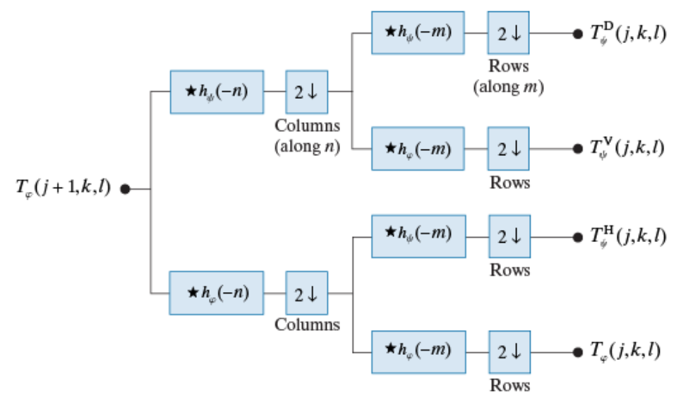
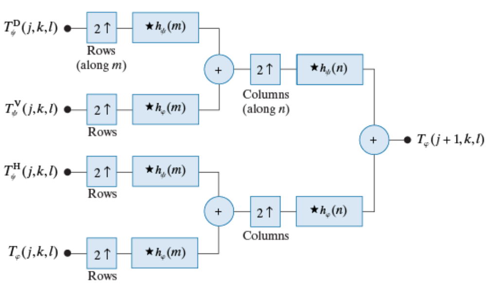
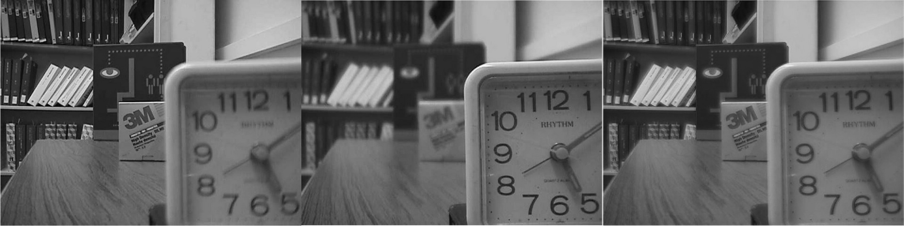
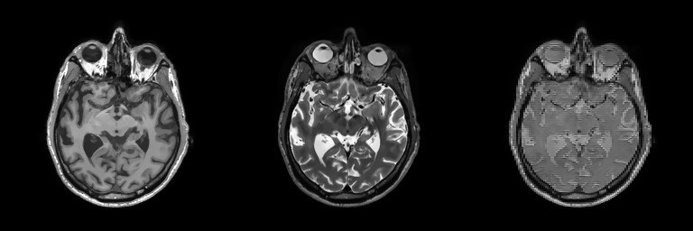
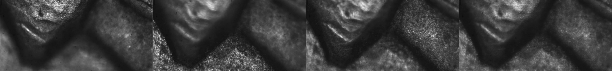

# README  

## Problem  
*more detail, please see [C1HW06-2018.pdf](./C1HW06-2018.pdf).*

* Implement **geometric transformation** of an image.
* Implement an image fusion program applying the DWT method.
* Apply a Hough transform method.

## Program  
### Image Fusion  
#### DWT  


$$
\left\{\begin{array}{cl}
h_\phi[-n]=\{\frac{1}{\sqrt2},\frac{1}{\sqrt2}\}\\ 
h_\psi[-n]=\{\frac{-1}{\sqrt2},\frac{1}{\sqrt2}\}
\end{array}\right.
$$

$\phi$

#### IDWT  



### Hough transform method  

## Usage  
## Usage  
```sh
$ cd hw6_cli
$ qmake -makefile
$ make
# Image Fusion 
$ ./hw6_cli if <img1> <imgs2> ...
# Hough transform method
$ ./hw6_cli ht <image>
```

## Results
### Image Fusion  
img1, img2, ..., fusion_img


