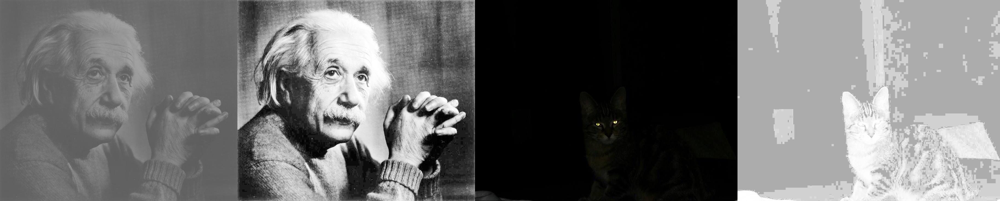
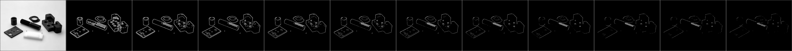
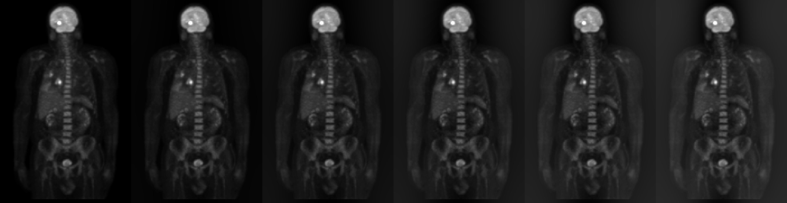
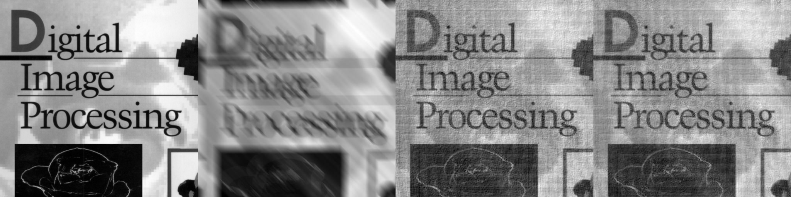

# README  
*PADIP means Principles and Applications of Digital Image Processing*

## My Tool  
### Concatenate images  
```sh
$ python3 long_long_image.py <image-folder>
# [ ], [ ], [ ] -> [ | | ]
```
### Convert to .jpg file  
```sh
$ python3 to_jpg.py <filename>
```

## hw1  
*more detail, please see [hw1/README](C1HW01-2018/README.md).*
* .64 image file reader
* Image histogram
* Arithmetic operations of an Image

## hw2  
*more detail, please see [hw2/README](C1HW02-2018/README.md).*
* Implement
  * threshold
  * enlarge, shrink
  * brightness, constrast
  * histogram equalization



## hw3  
*more detail, please see [hw3/README](C1HW03-2018/README.md).*
* Filtering operation
* Marr-Hildreth edge detection
* Order-statistic filter




## hw4  
*more detail, please see [hw4/README](C1HW04-2018/README.md).*
* Fourier transform(FFT)
* ighpass and lowpass filter
* homomorphic filter
* remove motion blur of image




## hw5  
*more detail, please see [hw5/README](C1HW05-2018/README.md).*
* color model conversion
* pseudo-color
* image segmentation


## hw6  
*more detail, please see [hw6/README](C1HW06-2018/README.md).*
* DWT method
* Hough transform method


